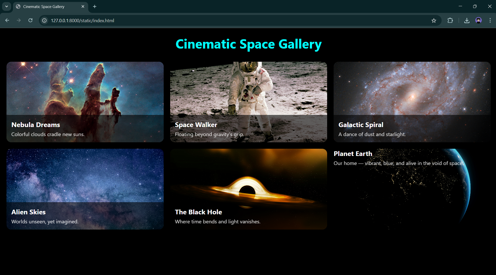
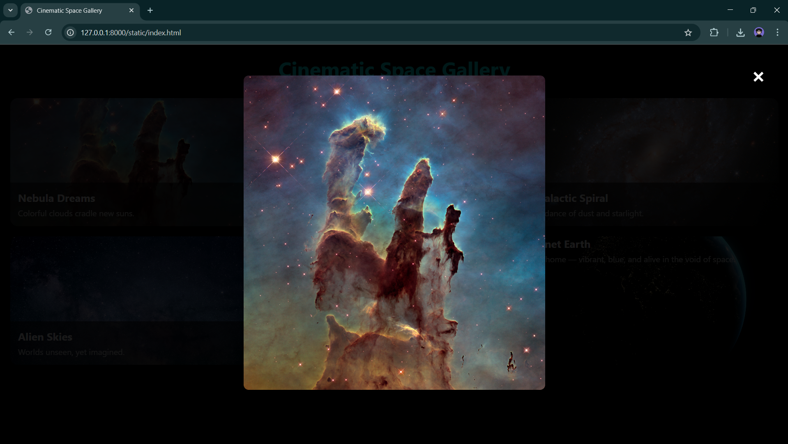

# Ex.08 Design of Interactive Image Gallery
## Date:15-05-2025

## AIM:
To design a web application for an inteactive image gallery with minimum five images.

## DESIGN STEPS:

### Step 1:
Clone the github repository and create Django admin interface.

### Step 2:
Change settings.py file to allow request from all hosts.

### Step 3:
Use CSS for positioning and styling.

### Step 4:
Write JavaScript program for implementing interactivity.

### Step 5:
Validate the HTML and CSS code.

### Step 6:
Publish the website in the given URL.

## PROGRAM :
```
index.html

<!DOCTYPE html>
<html lang="en">
<head>
  <meta charset="UTF-8">
  <title>Cinematic Space Gallery</title>
  <link rel="stylesheet" href="style.css">
</head>
<body>
  <h1 class="main-title">Cinematic Space Gallery</h1>
  <div class="gallery-grid">

    <div class="card" style="background-image: url('images/space2.jpg')">
      <div class="info">
        <h2>Nebula Dreams</h2>
        <p>Colorful clouds cradle new suns.</p>
      </div>
    </div>

    <div class="card" style="background-image: url('images/space1.jpg')">
      <div class="info">
        <h2>Space Walker</h2>
        <p>Floating beyond gravity’s grip.</p>
      </div>
    </div>

    <div class="card" style="background-image: url('images/space3.jpg')">
      <div class="info">
        <h2>Galactic Spiral</h2>
        <p>A dance of dust and starlight.</p>
      </div>
    </div>

    <div class="card" style="background-image: url('images/space4.jpg')">
      <div class="info">
        <h2>Alien Skies</h2>
        <p>Worlds unseen, yet imagined.</p>
      </div>
    </div>

    <div class="card" style="background-image: url('images/space5.jpg')">
      <div class="info">
        <h2>The Black Hole</h2>
        <p>Where time bends and light vanishes.</p>
      </div>

    </div>
      <div class="card" style="background-image: url('images/space6.jpg');">
         <h2>Planet Earth</h2>
         <p>Our home — vibrant, blue, and alive in the void of space.</p>
    </div>


</div>
  <div id="image-modal" class="modal">
  <span class="close">&times;</span>
  
</div>

  <script src="script.js"></script>
</body>
</html>

style.css

* {
  margin: 0;
  padding: 0;
  box-sizing: border-box;
}

body {
  background-color: black;
  font-family: 'Segoe UI', sans-serif;
  color: white;
  padding: 20px;
}

.main-title {
  text-align: center;
  font-size: 2.5rem;
  margin-bottom: 30px;
  color: cyan;
}

.gallery-grid {
  display: grid;
  grid-template-columns: repeat(3, 2fr); /* Forces 4 columns */
  gap: 20px;
}


.card {
  position: relative;
  height: 250px;
  background-size: cover;
  background-position: center;
  border-radius: 15px;
  overflow: hidden;
  transition: transform 0.3s ease;
  cursor: pointer;
}

.card:hover {
  transform: scale(1.03);
}

.card .info {
  position: absolute;
  bottom: 0;
  width: 100%;
  background: rgba(0, 0, 0, 0.6);
  padding: 15px;
}

.card h2 {
  font-size: 1.3rem;
  margin-bottom: 5px;
}

.card p {
  font-size: 1rem;
  opacity: 0.8;
}
.modal {
  display: none;
  position: fixed;
  z-index: 1000;
  padding-top: 60px;
  left: 0;
  top: 0;
  width: 100%;
  height: 100%;
  background-color: rgba(0,0,0,0.9);
}

.modal-content {
  display: block;
  margin: auto;
  max-width: 90%;
  max-height: 80%;
  border-radius: 10px;
}

.close {
  position: absolute;
  top: 30px;
  right: 45px;
  color: white;
  font-size: 40px;
  font-weight: bold;
  cursor: pointer;
  z-index: 1001;
}

.close:hover {
  color: red;
}

script.js

window.addEventListener('scroll', () => {
  document.querySelectorAll('.gallery-item').forEach(section => {
    const rect = section.getBoundingClientRect();
    if (rect.top < window.innerHeight - 100) {
      section.classList.add('active');
    }
  });
});
const modal = document.getElementById("image-modal");
const modalImg = document.getElementById("modal-img");
const closeBtn = document.querySelector(".close");

document.querySelectorAll(".card").forEach(card => {
  card.addEventListener("click", () => {
    const bg = card.style.backgroundImage;
    const imageUrl = bg.slice(5, -2); // remove url("...")

    modal.style.display = "block";
    modalImg.src = imageUrl;
  });
});

closeBtn.onclick = () => {
  modal.style.display = "none";
};

window.onclick = (event) => {
  if (event.target == modal) {
    modal.style.display = "none";
  }
};
```
## OUTPUT:




## RESULT:
The program for designing an interactive image gallery using HTML, CSS and JavaScript is executed successfully.
